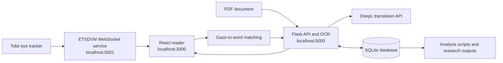

# ETS — Eye-Tracking Translation Support for PDF Reading

ETS is a research prototype that helps a person read English PDF documents by using real-time gaze data to identify the word they are looking at and provide a Greek translation. It combines PDF rendering, OCR-derived word locations, Tobii eye tracking, gaze-to-word matching, DeepL translation, and experiment logging in one system.

This repository is the software and analysis workspace for a Diploma Thesis at the University of Patras. The experimental results are intended to support a future research paper. The project and the included analyses should therefore be treated as thesis research in progress rather than a finished commercial product or a peer-reviewed publication.

## What the system does

- Creates local user profiles and stores preferences such as theme, zoom, gaze threshold, detection mode, translation mode, and popup condition.
- Uploads and displays PDFs in a React reader.
- Converts PDF pages to images and uses Tesseract OCR to locate words and sentence context.
- Connects to a Tobii eye tracker through the separate [ETSDVM service](https://github.com/greekatos/ETSDVM/tree/master).
- Maps gaze samples to OCR word boxes and requests a translation when the configured detection threshold is reached.
- Supports word and sentence translation through DeepL.
- Shows or suppresses translation popups for the experimental `ON` and `OFF` conditions while continuing to record detections.
- Stores documents, settings, sessions, translations, feedback, and experiment events in SQLite.
- Exports study data and reproduces descriptive, hypothesis-testing, mixed-effects, reading-speed, translation-volume, and video-reviewed repetition analyses.

## How it works



When a PDF is opened, the backend renders each page and Tesseract extracts words and their bounding boxes. The frontend scales those boxes to the displayed PDF. Gaze samples arrive from ETSDVM over WebSocket, are mapped to screen coordinates, and are checked against the visible word boxes. Once the configured sample threshold identifies a word, the frontend asks the backend for sentence context and a DeepL translation. The result and the current experiment settings are recorded in SQLite; the popup is displayed only when the current condition enables it.

More detailed runtime diagrams are available in [`back-end/documentation/application_sequence_diagrams.md`](back-end/documentation/application_sequence_diagrams.md).

## Repository structure

| Path | Purpose |
| --- | --- |
| `front-end/` | React and TypeScript PDF reader, settings UI, gaze processing, and translation popup |
| `back-end/app.py` | Flask REST API for profiles, PDFs, OCR, translation, sessions, and experiment data |
| `back-end/functions.py` | OCR and ETSDVM WebSocket helpers |
| `back-end/ETSsqLiteDB` | SQLite database used by the application and analyses |
| `back-end/*analysis*.py` | Reproducible statistical analysis scripts |
| `back-end/statistical_analysis_results/` | Derived datasets, reports, tables, figures, and audit context |
| `back-end/quiz_exports/` | Compressed questionnaire and quiz exports used by the analyses |
| `proxy-server/` | Legacy Google Translate proxy; the current application translation route uses DeepL |
| `toggle-tracking/` | Small auxiliary React prototype for testing tracking toggles |

## Requirements

- Python 3.10
- Node.js 18 or newer and npm
- [Tesseract OCR](https://tesseract-ocr.github.io/) with English language data
- [Poppler](https://poppler.freedesktop.org/) for PDF rendering
- A DeepL API key
- For live gaze tracking: a supported Tobii eye tracker, Tobii Pro software/drivers, and the ETSDVM service

Install the native OCR dependencies before the Python packages:

```bash
# macOS
brew install tesseract poppler

# Ubuntu/Debian
sudo apt-get update
sudo apt-get install tesseract-ocr poppler-utils
```

On Windows, install Tesseract and Poppler separately and add their executable directories to `PATH`.

## Setup

Clone this repository and enter it:

```bash
git clone git@github.com:AtaQou/ETS.git
cd ETS
```

Create a Python environment and install all backend and analysis libraries with one requirements command:

```bash
python3.10 -m venv .venv
source .venv/bin/activate          # Windows: .venv\Scripts\activate
python -m pip install --upgrade pip
python -m pip install -r back-end/requirements.txt
```

Install the frontend packages from the committed lock file:

```bash
cd front-end
npm ci
cd ..
```

Create `back-end/.env` and add your DeepL credential:

```dotenv
DEEPL_API_KEY=your_deepl_api_key
```

The optional variables `DEEPL_TRANSLATOR_ENDPOINT`, `DEEPL_MODEL_TYPE`, `DEEPL_SPLIT_SENTENCES`, and `DEEPL_TRANSLATOR_TIMEOUT_SECONDS` override the defaults in `back-end/appsettings.json`. Do not commit `.env`; it is ignored by Git.

## Run the application

The Flask server uses paths relative to `back-end`, so start it from that directory:

```bash
# Terminal 1
source .venv/bin/activate          # Windows: .venv\Scripts\activate
cd back-end
python app.py
```

Start the frontend in a second terminal:

```bash
# Terminal 2
cd front-end
npm start
```

Open [http://localhost:3000](http://localhost:3000). The UI calls the Flask API at `http://localhost:5000/api`.

For eye-tracking features, clone and start [ETSDVM](https://github.com/greekatos/ETSDVM/tree/master) according to that project's instructions before connecting a tracker. ETS expects its WebSocket endpoint at `ws://localhost:5001`. The reader and profile/document features can be inspected without the hardware, but live calibration, tracking, and gaze-triggered translation require ETSDVM and a compatible Tobii device.

## Typical research workflow

1. Create or select a participant profile.
2. Upload and select a PDF.
3. Search for, connect, and calibrate the eye tracker.
4. Start tracking and conduct the reading task under the selected popup condition.
5. End the session and export or inspect the recorded experiment data.
6. Run the analysis scripts to regenerate the statistical outputs.

The included database and exports contain the thesis experiment data used by the scripts. Handle them as research data and review participant/privacy requirements before redistributing them.

## Reproduce the analyses

Run the scripts from `back-end` with the virtual environment active. The main analysis sequence is:

```bash
cd back-end
python analyze_quiz_exports.py
python mixed_effects_analysis.py
python hypothesis_testing_analysis.py
python analyze_popup_on_translation_volume.py
python analyze_popup_on_volume_off_performance.py
python analyze_popup_on_wpm_progress.py
python analyze_video_repetitions.py
```

Outputs are written under `back-end/statistical_analysis_results/`. See its [results guide](back-end/statistical_analysis_results/README.md) for the purpose of each report, dataset, model table, audit file, and figure. In particular, `audits_and_context/video_review_repetition_template.csv` is the manually reviewed input for the video-repetition analyses.

Database exports can be generated separately:

```bash
cd back-end
python export_db_to_csv.py
python export_experiment_reports.py --help
```

## Development commands

```bash
cd front-end
npm test                 # React test runner
npm run build            # Production frontend build
```

The backend can also be built from `back-end/Dockerfile`, although live Tobii discovery and OCR still depend on the required device access and native tools being available to the container.

## Research and citation status

This is a Diploma Thesis project and the basis of planned publication work. No paper citation is available in the repository yet. If a paper, DOI, or institutional thesis record is published, add its bibliographic entry here so that users can cite the research accurately.

No license file is currently included. Unless a license is added, the repository's source and data remain protected by the default copyright rules.
